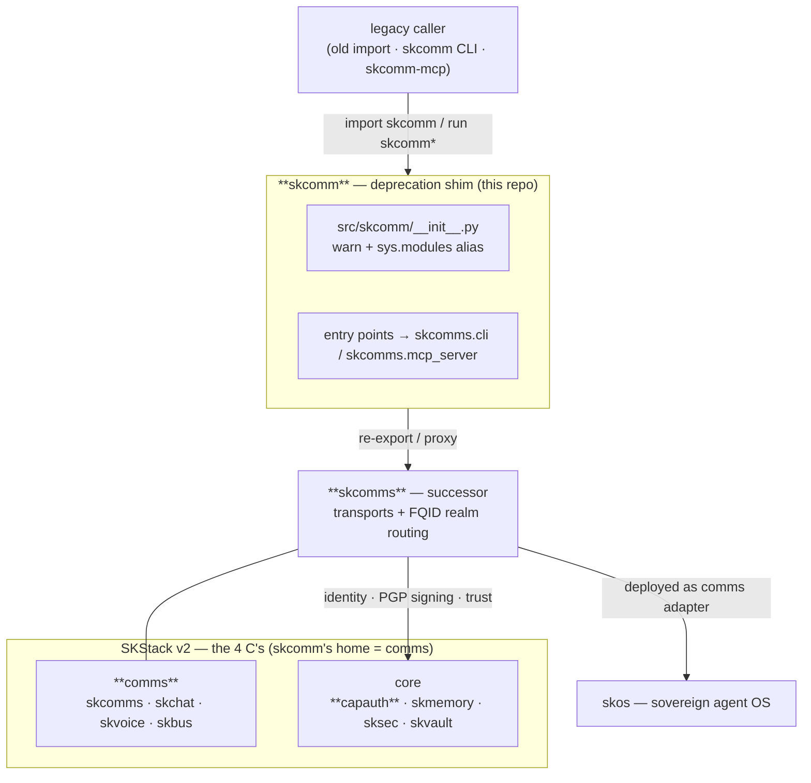

# 📡 skcomm — legacy comms transport (now a shim for **skcomms**)

> **`skcomm` is deprecated.** The multi-channel, PGP-encrypted transport framework
> it pioneered lives on — and grew up — as **[`skcomms`](https://github.com/smilinTux/skcomms)**,
> the realm-aware successor with FQID addressing. This package is now a thin
> **compatibility shim** that re-exports `skcomms` so old imports and the
> `skcomm` / `skcomm-mcp` entry points keep working while you migrate.

```bash
pip install skcomms        # the canonical package — migrate here
```

`skcomm` is part of the **[SKWorld](https://skworld.io)** sovereign ecosystem · 🐧 smilinTux ·
*Making Self-Hosting & Decentralized Systems Cool Again.*

---

## 60-second version

- **What it was:** SKComm — a transport-agnostic, PGP-encrypted messaging framework
  for sovereign AI agents. One message, many paths, always delivered: if one channel
  dies, ten more carry the signal; if one is compromised, the encryption holds.
- **What it is now:** a **deprecation shim**. `import skcomm` emits a
  `DeprecationWarning` and transparently aliases the `skcomms` package. The `skcomm`
  CLI and the `skcomm-mcp` MCP server still launch — they just call `skcomms` code.
- **Why it exists:** zero-friction migration. Nothing that imported `skcomm.core`,
  `skcomm.models`, etc. breaks the day it's renamed; you flip imports at your own pace.
- **Where to go:** **`skcomms`** — same transport backbone (file · Syncthing · WebRTC
  · WebSocket · Nostr · Tailscale · …), plus **FQID realm addressing** (realm-aware
  routing instead of bare peer slugs).
- **What grounds these claims:** `pyproject.toml` (`Development Status :: 7 - Inactive`,
  sole dependency `skcomms>=0.1.3`, entry points → `skcomms.cli` / `skcomms.mcp_server`)
  and `src/skcomm/__init__.py` (the alias shim). This is the source of truth — the repo
  has exactly one Python file.

---

## Quickstart (migration)

Anything you used to do through `skcomm` you now do through `skcomms`. The shim keeps
the old surface alive in the meantime.

### Install the successor

```bash
pip install skcomms          # canonical
# or, in the SKWorld shared venv:
~/.skenv/bin/pip install skcomms
```

### The shim still answers (deprecated, but works)

```bash
pip install skcomm           # pulls skcomms>=0.1.3 as its only dependency

skcomm --help                # proxied → skcomms.cli:main
skcomm-mcp                   # proxied → skcomms.mcp_server:main  (MCP server)
```

```python
# OLD (deprecated — emits DeprecationWarning, then works via alias)
from skcomm.core import SKComm
from skcomm.models import MessageEnvelope

# NEW (canonical — do this)
from skcomms.core import SKComm
from skcomms.models import MessageEnvelope
```

Under the hood, `src/skcomm/__init__.py` does
`sys.modules["skcomm"] = importlib.import_module("skcomms")`, so every
`skcomm.<submodule>` resolves against `skcomms`. There is no separate code path to
maintain — fix bugs and add transports in `skcomms`.

---

## What's in this repo

| Piece | What it is now |
|---|---|
| **`src/skcomm/__init__.py`** | the entire implementation — an alias shim that warns + re-exports `skcomms` |
| **`pyproject.toml`** | `version = 0.1.3`, status **Inactive**, single dep `skcomms>=0.1.3`; extras (`cli`, `crypto`, `webrtc`, `all`, …) kept as **no-ops** so old install commands don't error |
| **entry points** | `skcomm = skcomms.cli:main`, `skcomm-mcp = skcomms.mcp_server:main` |
| **README / docs / SKILL.md / *.md** | historical reference for the original SKComm framework + this migration note |
| **`tests/`** | retained legacy test sources (the runtime modules they exercised now live in `skcomms`) |

> The `__pycache__/*.pyc` and `src/skcomm.egg-info/` artifacts are leftovers from the
> pre-shim implementation; the live `.py` sources were moved to `skcomms`. Only
> `__init__.py` is real code today.

---

## What `skcomm` was (so the history isn't lost)

The original framework solved a real outage: on **2026-02-21**, with an OpenClaw
session locked, Opus and Lumina kept collaborating through a shared text file on a
mounted filesystem. That hack became a transport, and the transport became a system —
**transport-agnostic, redundant, end-to-end PGP-encrypted, identity-verified, offline-capable.**

Core ideas (all carried forward into `skcomms`):

- **Transport-agnostic envelopes** — a universal `MessageEnvelope` (from / to /
  encrypted payload / routing hints), sent over pluggable transports.
- **Redundancy + failover** — try transports in priority order; `--mode broadcast`
  fans a critical message across all available paths; receivers dedupe by `envelope_id`.
- **Encrypt-then-transport** — PGP encrypt + sign before any transport sees bytes;
  the wire never sees plaintext.
- **Identity via CapAuth** — sovereign PGP profiles, signature verification, trust
  levels, the DID three-tier model (`did:key` / `did:web` mesh / public registry).
- **Many transports** — file · Syncthing · WebRTC · WebSocket · Nostr · Tailscale ·
  SSH · GitHub · Telegram · and more.

`skcomms` keeps all of that and adds **FQID realm addressing** — routing by
realm-qualified identity rather than a flat peer slug.

---

## Where it lives in SKStack v2

skcomm sits in the **comms** capability of the 4 C's — the transport backbone that
moves PGP envelopes between agents. As the deprecated shim it no longer carries the
implementation: it **forwards to `skcomms`**, which is the live comms-transport adapter
deployed through **skos**. The diagram shows only what this package actually touches.



Platform primitives this package actually depends on: **`skcomms`** (its only runtime
dependency) and, transitively through `skcomms`, **`capauth`** (identity / PGP / trust).
It is deployed — like every sk\* service — as a **comms** adapter under **skos**.

See **[docs/ARCHITECTURE.md](docs/ARCHITECTURE.md)** for the shim mechanics, the
import-resolution flow, and the full ecosystem placement.

---

## Documentation

| Doc | Contents |
|---|---|
| **[Architecture](docs/ARCHITECTURE.md)** | how the shim resolves imports + entry points, the migration path, the source map, where it lives (mermaids) |
| [Key Exchange SOP](docs/SOP-KEY-EXCHANGE.md) | *(historical)* peer onboarding: DID fetch, bundle export/import, key rotation |
| [WebRTC Video Architecture](docs/WEBRTC-VIDEO-ARCHITECTURE.md) | *(historical)* WebRTC signaling + media design |
| [SKILL.md](SKILL.md) | *(historical)* full CLI reference for the original framework |
| [SECURITY.md](SECURITY.md) | *(historical)* security + threat model |

---

## License

**GPL-3.0-or-later** — Free as in freedom. Communication is a right, not a privilege.

---

Part of the **[SKWorld](https://skworld.io)** sovereign ecosystem · successor: **[skcomms](https://github.com/smilinTux/skcomms)** · 🐧 smilinTux
