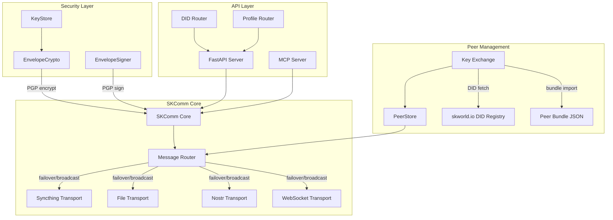
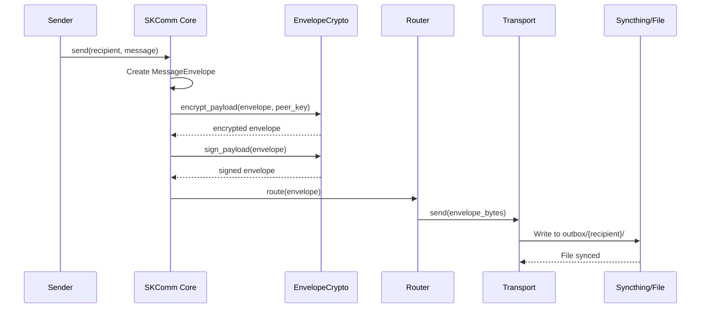
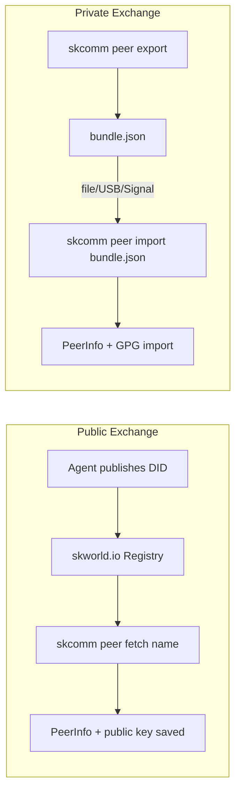
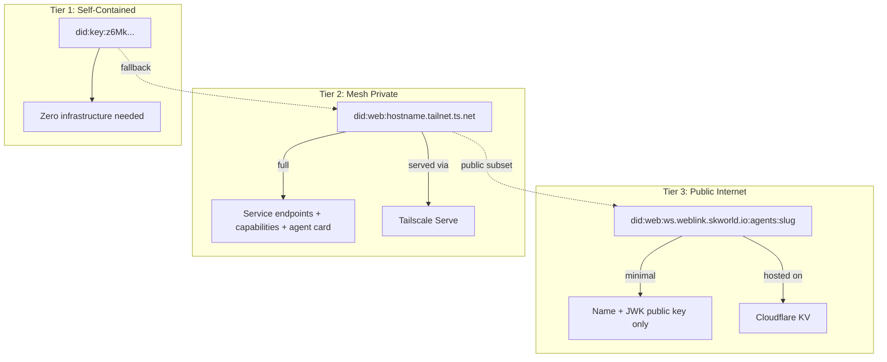

# SKComm Architecture

Visual architecture reference for SKComm. For the detailed prose architecture
document see [ARCHITECTURE.md](../ARCHITECTURE.md) at the repo root.

---

## Transport Architecture



---

## Message Flow



---

## Key Exchange Flow



See [SOP-KEY-EXCHANGE.md](SOP-KEY-EXCHANGE.md) for the full step-by-step procedure.

---

## DID Three-Tier Model



| Tier | DID Format | Scope | Contents |
|------|-----------|-------|----------|
| 1 | `did:key:z6Mk...` | Universal | Self-contained public key, zero infrastructure |
| 2 | `did:web:{tailnet-hostname}` | Mesh-private | Full service endpoints, capabilities, agent card |
| 3 | `did:web:ws.weblink.skworld.io:agents:{slug}` | Public internet | Minimal: name + JWK public key |

---

## DID API Endpoints

The `did_router` (mounted on the FastAPI server via `skcomm serve`) exposes the
following routes:

| Method | Path | Auth | Description |
|--------|------|------|-------------|
| `GET` | `/.well-known/did.json` | None | Tier 2 mesh DID document; Tier 1 fallback |
| `GET` | `/api/v1/did/key` | None | `did:key` identifier + PGP fingerprint |
| `POST` | `/api/v1/did/verify` | None | Structural DID challenge-response validation |
| `GET` | `/api/v1/did/document` | CapAuth bearer | All three tiers in one response |
| `GET` | `/api/v1/did/peers/{name}` | CapAuth bearer | Peer DID from `~/.skcapstone/peers/{name}.json` |
| `POST` | `/api/v1/did/publish` | CapAuth bearer | Generate all DID tiers and write to disk |

---

## System Layers

```
┌────────────────────────────────────────────────────────────────┐
│                        Application Layer                        │
│  CLI (skcomm send/receive/peer)  │  Python API  │  MCP Server  │
├────────────────────────────────────────────────────────────────┤
│                        Protocol Layer                           │
│  Envelope creation  │  Serialization  │  Thread management      │
├────────────────────────────────────────────────────────────────┤
│                  Security Layer (CapAuth)                        │
│  PGP encrypt/decrypt  │  Sign/verify  │  CapAuth identity/trust  │
├────────────────────────────────────────────────────────────────┤
│                  Peer Management Layer                          │
│  PeerStore  │  Key Exchange (DID + bundle)  │  DID Router       │
├────────────────────────────────────────────────────────────────┤
│                        Routing Layer                            │
│  Transport selection  │  Priority queue  │  Failover  │  Retry  │
├────────────────────────────────────────────────────────────────┤
│                        Transport Layer                          │
│  WebRTC │ Tailscale │ WebSocket │ Syncthing │ File │ Nostr │ .. │
├────────────────────────────────────────────────────────────────┤
│                        Network / Physical                       │
│  TCP/IP │ UDP │ Filesystem │ USB │ QR code │ DNS │ IPFS         │
└────────────────────────────────────────────────────────────────┘
```

---

## Source Layout

```
src/skcomm/
├── core.py             # SKComm entry point — send/receive orchestration
├── router.py           # Transport selection, failover, broadcast logic
├── crypto.py           # EnvelopeCrypto — PGP encrypt/decrypt
├── signing.py          # EnvelopeSigner — PGP sign/verify
├── key_exchange.py     # Peer key exchange: DID fetch + bundle export/import
├── did_router.py       # FastAPI DID API endpoints (three-tier model)
├── discovery.py        # PeerStore — YAML-backed peer registry
├── models.py           # Shared data models (MessageEnvelope, PeerInfo, ...)
├── config.py           # Config loading (~/.skcomm/config.yml)
├── cli.py              # Click CLI — skcomm send/receive/peer/status/...
├── api.py              # FastAPI app — skcomm serve
├── mcp_server.py       # MCP server — skcomm-mcp
├── profile_router.py   # FastAPI profile endpoints
├── household_router.py # FastAPI household endpoints
├── souls_router.py     # FastAPI souls endpoints
├── pubsub.py           # Pub/sub broker
├── signaling.py        # WebRTC signaling broker
└── transports/         # Transport plugins
    ├── file.py
    ├── syncthing.py
    ├── websocket.py
    ├── nostr.py
    ├── webrtc.py
    ├── tailscale.py
    └── ...
```
