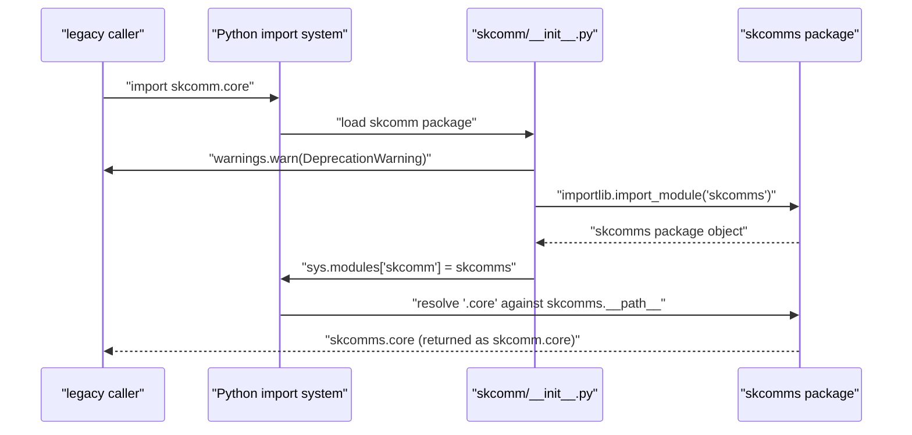
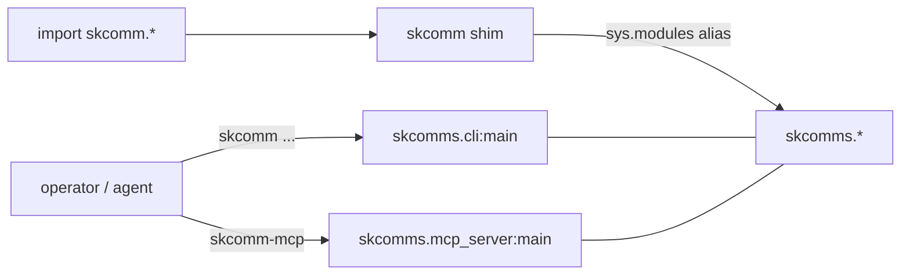
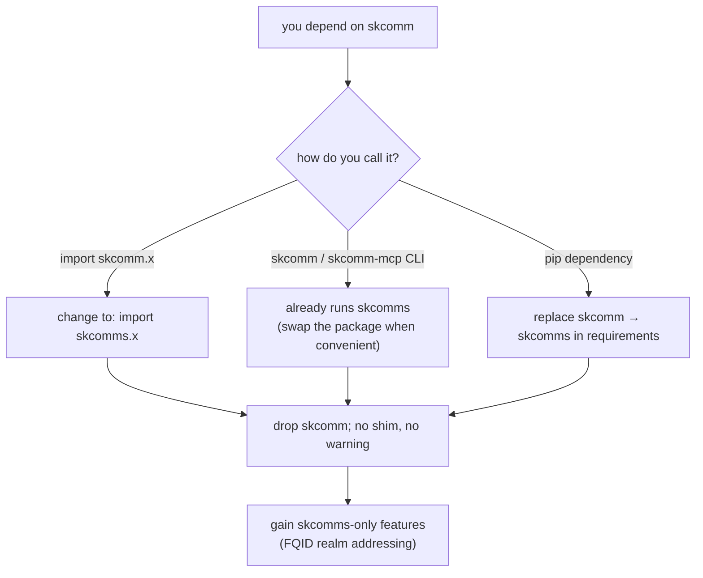
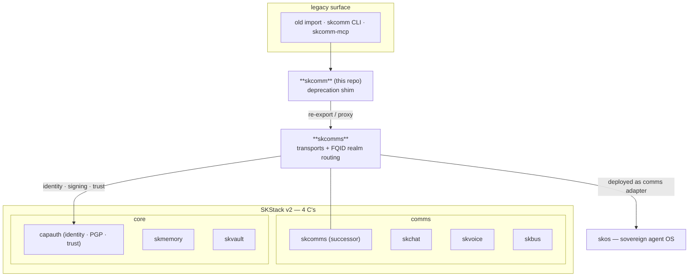

# skcomm Architecture

> **Status: deprecated shim.** `skcomm` no longer contains the comms implementation.
> It is a thin compatibility layer that **re-exports [`skcomms`](https://github.com/smilinTux/skcomms)**
> (the realm-aware successor) so legacy imports and the `skcomm` / `skcomm-mcp`
> entry points keep working during migration. This document describes how that
> shim works, the migration path, and where the package sits in SKStack v2.
>
> For the *historical* architecture of the original transport framework — envelopes,
> the router, the transport plugins, the DID three-tier model — see the legacy
> [`../ARCHITECTURE.md`](../ARCHITECTURE.md), [`SOP-KEY-EXCHANGE.md`](SOP-KEY-EXCHANGE.md),
> and [`WEBRTC-VIDEO-ARCHITECTURE.md`](WEBRTC-VIDEO-ARCHITECTURE.md). Those describe code
> that now lives in `skcomms`.

---

## What this package reuses vs. builds

**Reuses (everything):** the entire comms implementation — envelopes, the priority
router, failover/broadcast, PGP encrypt/sign, CapAuth identity, the transport plugins
(file · Syncthing · WebRTC · WebSocket · Nostr · Tailscale · …), the CLI, and the MCP
server — all now live in **`skcomms`**.

**Builds (almost nothing):** one alias shim (`src/skcomm/__init__.py`) and a packaging
descriptor (`pyproject.toml`) whose only job is to depend on `skcomms` and forward the
console entry points to it.

The contract: **import `skcomm` and you get `skcomms`, with a one-time deprecation
warning.** Nothing else.

---

## The shim (the core)

`skcomm` is a single Python module that, on first import, warns and then makes the
running interpreter treat `skcomm` as an alias for `skcomms`.

```python
# src/skcomm/__init__.py  (paraphrased)
import importlib, sys, warnings

warnings.warn("skcomm is deprecated — import from skcomms instead",
              DeprecationWarning, stacklevel=2)

_pkg = importlib.import_module("skcomms")
sys.modules[__name__] = _pkg     # ← the trick: skcomm *becomes* skcomms
```

The final line replaces the entry for `skcomm` in `sys.modules` with the already-imported
`skcomms` package object. After that, **any** dotted access — `skcomm.core`,
`skcomm.models`, `skcomm.transports.file` — is resolved against `skcomms.__path__`,
because the importer is now looking inside the `skcomms` package. No per-submodule shims
are needed; one alias covers the whole namespace.

### Import-resolution lifecycle


```mermaid
sequenceDiagram
    participant App as "legacy caller"
    participant Py as "Python import system"
    participant Shim as "skcomm/__init__.py"
    participant Skcomms as "skcomms package"

    App->>Py: "import skcomm.core"
    Py->>Shim: "load skcomm package"
    Shim->>App: "warnings.warn(DeprecationWarning)"
    Shim->>Skcomms: "importlib.import_module('skcomms')"
    Skcomms-->>Shim: "skcomms package object"
    Shim->>Py: "sys.modules['skcomm'] = skcomms"
    Py->>Skcomms: "resolve '.core' against skcomms.__path__"
    Skcomms-->>App: "skcomms.core (returned as skcomm.core)"
```

### Entry-point proxying

The two console scripts never point at `skcomm` code — `pyproject.toml` wires them
straight to `skcomms`:

```toml
[project.scripts]
skcomm     = "skcomms.cli:main"
skcomm-mcp = "skcomms.mcp_server:main"
```

So `skcomm send …` and the `skcomm-mcp` MCP server run `skcomms` from the very first
call; there is not even a shim hop for the CLIs.


```mermaid
flowchart LR
    U["operator / agent"]
    U -->|"skcomm ..."| C1["skcomms.cli:main"]
    U -->|"skcomm-mcp"| C2["skcomms.mcp_server:main"]
    PI["import skcomm.*"] --> SH["skcomm shim"] -->|"sys.modules alias"| SK["skcomms.*"]
    C1 --- SK
    C2 --- SK
```

### Packaging as a no-op forwarder

`pyproject.toml` is deliberately inert beyond the redirect:

- `version = "0.1.3"`, `Development Status :: 7 - Inactive`.
- Single runtime dependency: **`skcomms>=0.1.3`** (installing `skcomm` pulls `skcomms`).
- Optional-dependency **extras kept as empty no-ops** (`cli`, `crypto`, `nostr`,
  `websocket`, `webrtc`, `discovery`, `api`, `all`) so historical install commands like
  `pip install "skcomm[cli,crypto,webrtc]"` still succeed instead of erroring.
- `[tool.setuptools.packages.find] where = ["src"]` packages only `src/skcomm/`.

---

## Migration path


```mermaid
flowchart TD
    START["you depend on skcomm"]
    START --> Q{"how do you call it?"}
    Q -->|"import skcomm.x"| I["change to: import skcomms.x"]
    Q -->|"skcomm / skcomm-mcp CLI"| K["already runs skcomms<br/>(swap the package when convenient)"]
    Q -->|"pip dependency"| D["replace skcomm → skcomms in requirements"]
    I --> DONE["drop skcomm; no shim, no warning"]
    K --> DONE
    D --> DONE
    DONE --> PLUS["gain skcomms-only features<br/>(FQID realm addressing)"]
```

The shim guarantees **no flag-day cutover**: code keeps running on `skcomm` while you
migrate imports module-by-module, then you remove `skcomm` from your dependencies.

---

## Source map

| Path | Role |
|---|---|
| `src/skcomm/__init__.py` | **The shim.** Emits `DeprecationWarning`, imports `skcomms`, aliases `sys.modules["skcomm"] = skcomms`. The only live code. |
| `pyproject.toml` | Packaging descriptor: Inactive status, `skcomms>=0.1.3` dependency, no-op extras, entry points → `skcomms.cli` / `skcomms.mcp_server`. |
| `tests/` | Legacy test sources retained for history; the runtime modules they target now live in `skcomms`. |
| `README.md` · this file | Migration-facing docs + the shim's design. |
| `../ARCHITECTURE.md`, `SOP-KEY-EXCHANGE.md`, `WEBRTC-VIDEO-ARCHITECTURE.md`, `SKILL.md`, `SECURITY.md` | **Historical** design of the original framework — accurate description of code that moved to `skcomms`. |
| `src/skcomm.egg-info/`, `__pycache__/*.pyc` | Build/compile artifacts left from the pre-shim implementation; not source of truth. |

---

## Where it lives in the ecosystem

skcomm belongs to the **comms** capability of SKWorld's 4 C's — the layer that moves
encrypted envelopes between agents. As a deprecated shim it holds no implementation; it
**points to `skcomms`**, the live comms-transport adapter that **skos** deploys.
`skcomms` in turn leans on **capauth** (core) for sovereign PGP identity and trust.


```mermaid
flowchart TD
    subgraph LEGACY["legacy surface"]
      CALL["old import · skcomm CLI · skcomm-mcp"]
    end
    CALL --> SKCOMM["**skcomm** (this repo)<br/>deprecation shim"]
    SKCOMM -->|"re-export / proxy"| SKCOMMS["**skcomms**<br/>transports + FQID realm routing"]

    subgraph C4["SKStack v2 — 4 C's"]
      direction LR
      subgraph COMMS["comms"]
        SKCOMMS2["skcomms (successor)"]
        SKCHAT["skchat"]
        SKVOICE["skvoice"]
        SKBUS["skbus"]
      end
      subgraph CORE["core"]
        CAPAUTH["capauth (identity · PGP · trust)"]
        SKMEM["skmemory"]
        SKVAULT["skvault"]
      end
    end

    SKCOMMS --- SKCOMMS2
    SKCOMMS -->|"identity · signing · trust"| CAPAUTH
    SKCOMMS -->|"deployed as comms adapter"| SKOS["skos — sovereign agent OS"]
```

**Dependencies this package truly has:** `skcomms` (direct, sole) and — transitively
through it — `capauth` for identity/PGP/trust. Everything else in the original
"integration" lists belongs to `skcomms`, not to this shim.

---

Part of the **[SKWorld](https://skworld.io)** sovereign ecosystem · successor: **[skcomms](https://github.com/smilinTux/skcomms)** · 🐧 smilinTux
